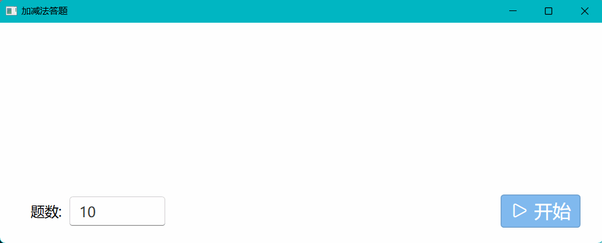
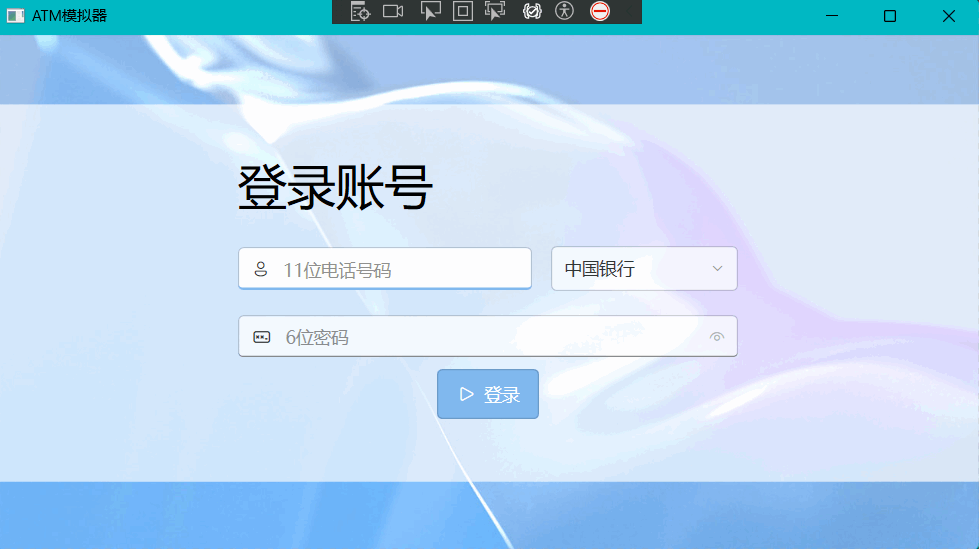

# .NET 架构程序设计
2023-2024学年度第一学期计算机学院专业选修课程《.NET 架构程序设计》个人作业，采用的 Nuget 包有：
- CommunityToolkit.Mvvm：MVVM 模式必用工具库
- Microsoft.Extensions.DependencyInjection：提供 IoC 依赖注入容器服务
- Microsoft.Toolkit.Uwp.Notifications：提供 Windows 10/11 Toast 消息发送服务
- WPF-UI：提供类似于 Windows 11 的 Fluent Design 风格的控件库
## 第一次作业
简单的加减法答题器，实现倒计时功能

## 第二次作业
ATM 模拟器，实现账号登录，进度模拟，坏钞检测模拟，信用账户，记录查询等功能

## 第三次作业
简单的 C# 源代码格式化器，实现拖拽式文件选择，行数与单词数统计，单词计次排序，单行注释与空行清理等功能

## 第四次作业
简单的资源管理器，实现树状导航栏，文件夹浏览和文件运行，前进与后退导航，暗黑主题切换等功能

## 第五次作业
基础的爬虫，用 Bing 搜索结果拿到 HTML ，然后做正则表达式匹配电话号码，只要是符合格式的都会提取出来，所以其实问题很多。实现了真正的毛玻璃窗体效果

## 第六次作业
基础的数据库应用，以蔚蓝档案数据测试，仓库中数据库 BlueArchive.db 为 Ef Core 迁移时自动生成，没有数据。为了复用一个表格控件，采用动态生成列的方式，使用了大量反射技巧，实现了基本增删改查以及日志跟踪和搜索
